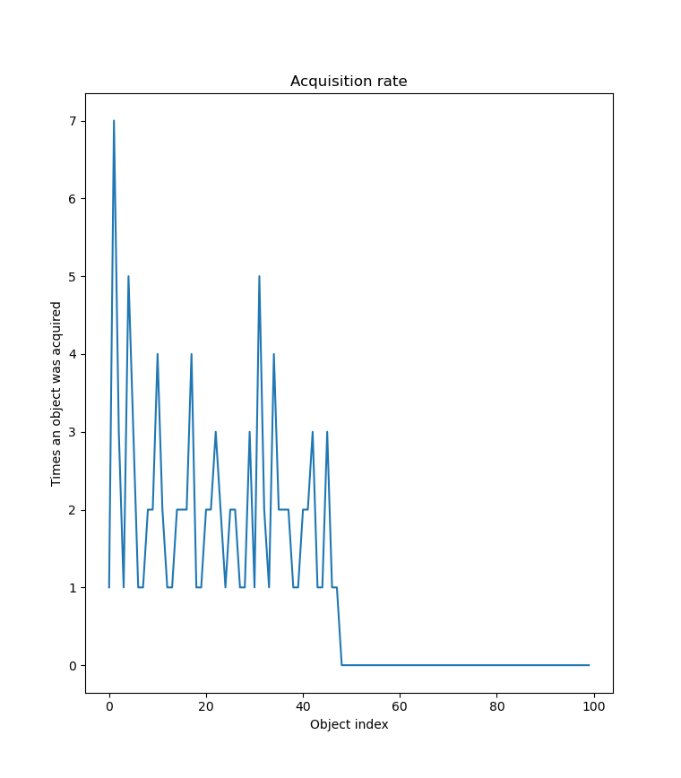

# Asynchronous Pool
This library provides you with a container that is unordered and thread-safe.

This particular implementation is totally unfair to the underlying objects. Meaning that if you acquire objects sequentially, you will always get the same object. And only if it is locked do you get a different one.

This is probably better for caching, but we will see.

## Vizualization
```
bash viz.sh
```

#### Model:
  - there are N threads and N objects
  - each thread acquires an object, holds it for a random amount of time and then puts it back
  - count each time an object was retrieved
  - draw a graph:
    - X - object index
    - Y - number of object's acquisitions



